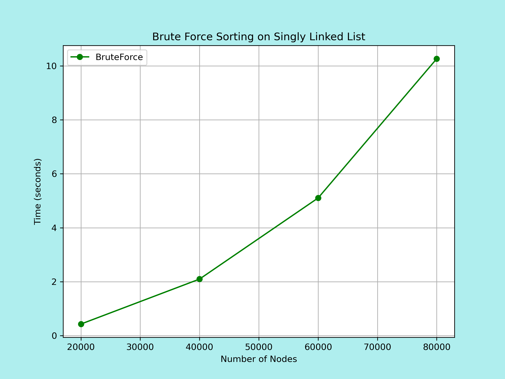
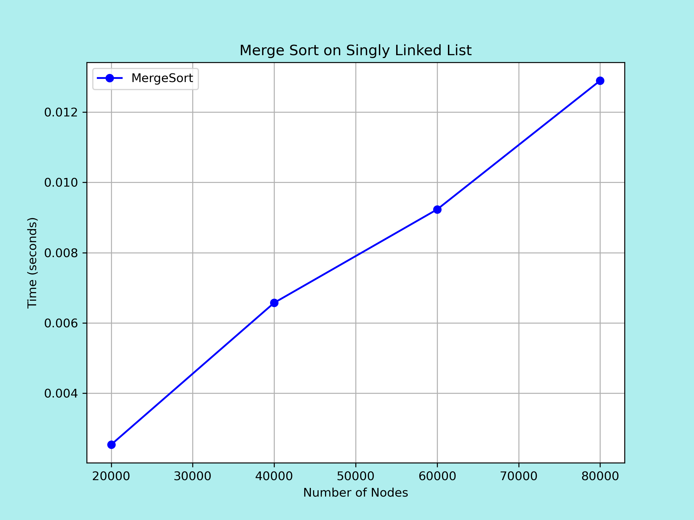
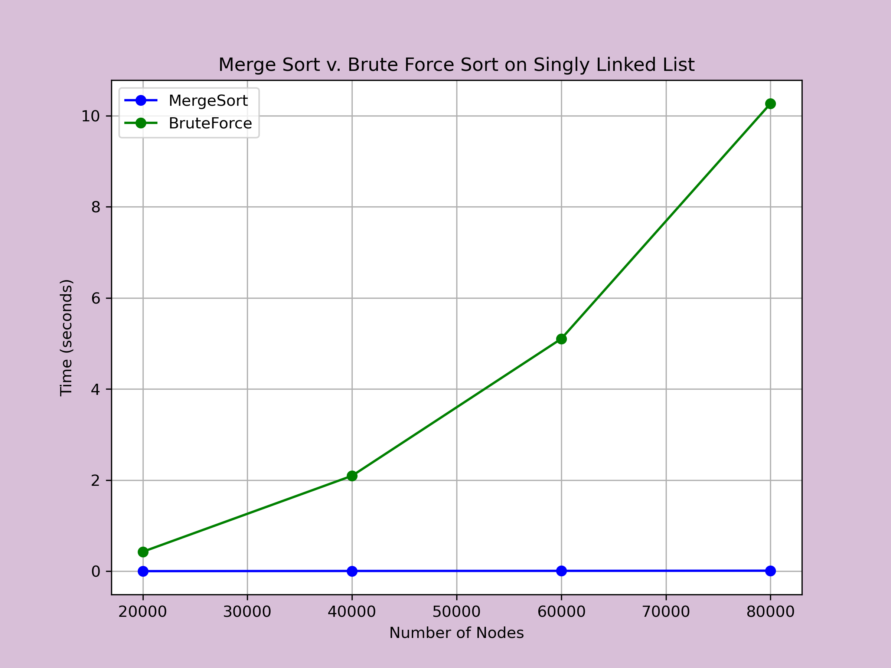

# Linked List Implementation & Sorting
Linked List Assignment (HW0) completed by Anushka Goswami on 07/29/2026 atop the basics repository.

After cloning, cd moving to Basics, running 'bash build.sh' should automatically run everything and generate plots that will get saved to the Basics repository. Plots embedded in this README were generated previously through the same code and are saved in the folder prev_gen_plots.

### Part A
Linked List Implementation:

I created a singly linked list using 'Node' objects defined through the Class 'Node'. Each node object has two 'variables', one stores the numerical data at that node, and the other stores a Node* pointer(address) to the next node. Every linked list used in this project is tracked using the 'head', a Node* pointer variable that stores the address of the first node. The last node of the linked list points to the nullptr.

### Part B
Brute Force Sorting a Singly Linked List:

For my first approach, I brute force sorted the integer data in my linked lists using two traversing pointers in nested while loops. It is a quick but inelegant solution, and not efficient. Consequently, since O(n) = n^2, we theorize that the sorting time increases by a factor of four each time the input size doubles. This is confirmed through our benchmark testing and can be seen in the data plotted below.

### Part C
MergeSorting the Linked List:

To optimize the sorting, I utilized MergeSort() as it provides log n levels of traversal for n operations, giving us O(n) = nlogn. Therefore, for the same input, this algorithm theoretically improves sorting speed by a factor of n/logn as compared to the brute force method. After benchmarking a few times, we can see the following practical results:

MergeSort is roughly 150-180 times faster than BruteForce for 20,000 nodes, and 750-800 times faster for 80,000 nodes. As mentioned above, theoretically, the MergeSort should be faster by a magnitude of n/logn, however in practical, the improvements may not be exact. However, we can still that that MergeSort is many orders of magnitude faster than BruteForce. 

Furthermore we can see the trends in sorting time for BruteForce and MergeSort. From 20,000 -> 40,000 nodes, when input doubles, BruteForce takes roughly 5x longer to sort. Whereas, from 20,000 -> 40,000 nodes, when input doubles, MergeSort takes roughly 2.5x longer to sort the linked list.

Plots are attached below:

### Project Assumptions
* I used a static memory global Node* array for my Linked List as there were no DMA requirements for the given task.
* I have used 'logn' as a simplification of log, base 2 of n.
* I have the latest version of cmake, gcc, etc. To fix some dependency issues, I also updated the version of google benchmark used in the CMakeLists.txt v1.9.3 which resolved some cmake & googletest issues.
* Rand() from cstdlib was used to generate values for my Linked List. While I am reasonably certain that my code can accommodate for negative integers, I did not test with negative integers. I do not believe that would have affected the execution of the algorithms in any way.
* I did not try to resolve any of the environmental package errors/dependency alerts/module alerts stemming from the parts of the code that I figured were aimed to be run through a teaching cluster.
* Script for the plots is provided in plots.py within the basics repository. All plots will generate on running the build.sh shell script.
* Results from the google benchmark tests get stored in results.json. This file should get rewritten each time the code gets executed through the build.sh script.

### Extra Notes & Miscellaneous Information

Some extra notes on my BruteForce function:

Due to the nature of the algorithm having nested loops, we can already reasonably ascertain that the time complexity of this approach would tend to n^2. Since my BruteForce sorting algorithm conducts (n-1) + (n-2) + (n-3).... + 2 + 1 comparisons (base operation), which forms the arithmetic series n(n-1)/2, we get (n^2 - n)/2, where the n^2 factor is dominant and 1/2 can be neglected.

